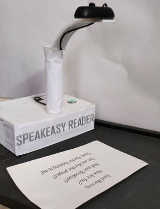
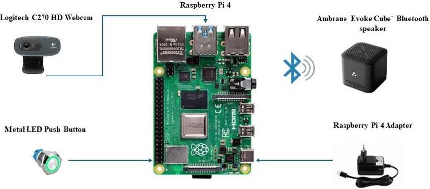

# 🗣️ Smart Reader for the Visually Impaired

<p align="center">
  
  
  
  
  
</p>

<p align="center">
  
  
</p>

---

## 📋 Table of Contents

- [Overview](#-overview)
- [Features](#-features)
- [System Architecture](#-system-architecture)
- [Hardware Components](#-hardware-components)
- [Software Stack](#-software-stack)
- [How It Works](#-how-it-works)
- [Performance Metrics](#-performance-metrics)
- [Installation & Setup](#-installation--setup)
- [Usage](#-usage)
- [Results & Gallery](#-results--gallery)
- [Limitations](#-limitations)
- [Future Enhancements](#-future-enhancements)
- [Research Publication](#-research-publication)
- [Contributors](#-contributors)
- [License](#-license)
- [Acknowledgments](#-acknowledgments)

---

## 🌟 Overview

**Smart Reader for the Visually Impaired** is an assistive technology device designed to empower visually impaired individuals with independent reading capabilities. Built on the Raspberry Pi platform, this embedded system converts printed text into real-time audible speech using advanced Optical Character Recognition (OCR) and Text-to-Speech (TTS) technologies.

This project addresses the critical need for affordable, portable, and user-friendly assistive reading devices, enabling users to access printed information independently without requiring sighted assistance.

### 🎯 Project Context

- **Academic Project**: Final Year Major Project
- **Department**: Electronics & Communication Engineering (ECE)
- **Institution**: REVA University, Bengaluru, India
- **Publication**: IEEE ICCCNT Conference 2024, IIT Mandi
- **Research Paper**: [View on IEEE Xplore](https://ieeexplore.ieee.org/document/10723858)

---

## ✨ Features

- **Real-Time Text Recognition**: Instant OCR processing with 97.13% accuracy
- **One-Button Operation**: Simple push-button interface for ease of use
- **Audio Feedback**: Clear text-to-speech output via Bluetooth speaker
- **Fast Processing**: ~1.1 seconds per image processing time
- **Portable Design**: Compact, self-contained unit with custom enclosure
- **Low Cost**: Affordable solution using off-the-shelf components
- **Embedded Integration**: Complete hardware-software system on Raspberry Pi
- **Assistive Technology**: Specifically designed for visually impaired users

---

## 🏗️ System Architecture

The Smart Reader follows a streamlined pipeline architecture:

```
User Input (Button Press) → Image Capture → Preprocessing → OCR → TTS → Audio Output
```

### Hardware Architecture

```
┌─────────────────────┐
│   Push Button       │
│   (GPIO17)          │
└──────┬──────────────┘
       │
       ▼
┌─────────────────────┐      ┌─────────────────────┐
│  Raspberry Pi 4     │◄────►│  Logitech C270      │
│  Model B            │      │  HD Webcam          │
└──────┬──────────────┘      └─────────────────────┘
       │
       ▼
┌─────────────────────┐
│  Bluetooth Speaker  │
│  (Audio Output)     │
└─────────────────────┘
```

### Software Pipeline

```
┌──────────────┐    ┌──────────────┐    ┌──────────────┐    ┌──────────────┐
│    Camera    │───►│   OpenCV     │───►│  Tesseract   │───►│   Festival   │
│   Capture    │    │  Processing  │    │     OCR      │    │     TTS      │
└──────────────┘    └──────────────┘    └──────────────┘    └──────────────┘
                           │                    │                    │
                           ▼                    ▼                    ▼
                    Grayscale/Blur      Text Extraction      Audio Generation
```

---

## 🔧 Hardware Components

| Component | Specification | Purpose |
|-----------|---------------|---------|
| **Microcontroller** | Raspberry Pi 4 Model B (4GB RAM) | Main processing unit |
| **Camera** | Logitech C270 HD Webcam (720p) | Image capture |
| **Input Interface** | Metal LED Push Button | User trigger mechanism |
| **Audio Output** | Bluetooth Speaker | Text-to-speech playback |
| **Power Supply** | 5V/3A USB-C Adapter | System power |
| **GPIO Connection** | GPIO17 with Pull-up Resistor | Button interface |
| **Enclosure** | Custom 3D-printed housing | Device protection |

---

## 💻 Software Stack

| Layer | Technology | Version | Purpose |
|-------|-----------|---------|---------|
| **Operating System** | Raspberry Pi OS | Bullseye | Linux-based OS |
| **Programming** | Python | 3.9+ | Core application logic |
| **Computer Vision** | OpenCV | 4.x | Image preprocessing |
| **OCR Engine** | Pytesseract | 0.3.x | Text extraction |
| **TTS Engine** | Festival | 2.5 | Speech synthesis |
| **Hardware Control** | RPi.GPIO | 0.7.x | GPIO management |
| **Image Processing** | PIL/Pillow | 9.x | Image manipulation |

### Key Python Libraries

```python
import cv2                  # Image processing
import pytesseract          # OCR functionality
import RPi.GPIO as GPIO     # Hardware control
import subprocess           # TTS execution
from PIL import Image       # Image handling
```

---

## ⚙️ How It Works

### Process Flow

1. **Initialization**
   - System boots and loads required libraries
   - GPIO pin configured for button input
   - Camera initialized and tested

2. **User Interaction**
   - User positions printed material under camera
   - User presses the push button (GPIO17)

3. **Image Acquisition**
   - Webcam captures high-resolution image
   - Image saved temporarily for processing

4. **Preprocessing** (OpenCV)
   - Conversion to grayscale
   - Noise reduction using Gaussian blur
   - Contrast enhancement
   - Thresholding for better text clarity

5. **Text Extraction** (Tesseract OCR)
   - Preprocessed image fed to Tesseract engine
   - OCR performs character recognition
   - Text extracted and formatted

6. **Speech Synthesis** (Festival TTS)
   - Extracted text passed to Festival
   - Audio generated from text
   - Speech output delivered via Bluetooth speaker

7. **Completion**
   - System returns to ready state
   - Waits for next button press

---

## 📊 Performance Metrics

### Accuracy Analysis

| Metric | Value | Notes |
|--------|-------|-------|
| **Average OCR Accuracy** | 97.13% | Tested on 100+ samples |
| **Processing Time** | ~1.1 seconds | Per image (capture to audio) |
| **Font Support** | High | Standard printed fonts |
| **Language Support** | English | Primary language |

### Test Conditions

- **Font Sizes**: 10pt - 14pt optimal
- **Lighting**: Natural/artificial indoor lighting
- **Text Type**: Printed documents, books, labels
- **Paper Quality**: Standard white/off-white paper

### Performance Visualization


*OCR accuracy and processing speed analysis across different test cases*

---

## 🚀 Installation & Setup

### Prerequisites

- Raspberry Pi 4 Model B (2GB+ RAM recommended)
- Raspberry Pi OS (Bullseye or later)
- Internet connection for initial setup
- All hardware components assembled

### System Setup

#### 1. Update System Packages

```bash
sudo apt-get update
sudo apt-get upgrade -y
```

#### 2. Install Required Dependencies

```bash
# Install Tesseract OCR
sudo apt-get install tesseract-ocr -y

# Install Festival TTS
sudo apt-get install festival -y

# Install Python dependencies
sudo apt-get install python3-pip python3-opencv -y

# Install additional libraries
pip3 install pytesseract RPi.GPIO pillow
```

#### 3. Configure Camera

```bash
# Enable camera interface
sudo raspi-config
# Navigate to: Interface Options → Camera → Enable
```

#### 4. GPIO Setup

```python
# GPIO pin configuration (in your Python script)
import RPi.GPIO as GPIO

BUTTON_PIN = 17
GPIO.setmode(GPIO.BCM)
GPIO.setup(BUTTON_PIN, GPIO.IN, pull_up_down=GPIO.PUD_UP)
```

#### 5. Bluetooth Speaker Setup

```bash
# Install Bluetooth packages
sudo apt-get install bluetooth bluez bluealsa -y

# Pair Bluetooth speaker
bluetoothctl
# > power on
# > agent on
# > scan on
# > pair [MAC_ADDRESS]
# > connect [MAC_ADDRESS]
```

### Hardware Assembly

1. Connect push button to GPIO17 and GND
2. Connect USB webcam to Raspberry Pi USB port
3. Pair Bluetooth speaker with Raspberry Pi
4. Connect 5V power supply
5. Assemble components in enclosure


*Detailed GPIO and peripheral connection diagram*

---

## 📖 Usage

### Basic Operation

1. **Power On**: Connect power supply to Raspberry Pi
2. **System Boot**: Wait for system initialization (~30 seconds)
3. **Position Text**: Place printed material under camera
4. **Capture**: Press the push button
5. **Listen**: Device reads the text aloud

### Running the Application

```bash
# Navigate to project directory
cd ~/smart-reader

# Run the main script
python3 smart_reader.py
```

### Sample Code Structure

```python
#!/usr/bin/env python3
import cv2
import pytesseract
import RPi.GPIO as GPIO
import subprocess
from time import sleep

# GPIO Configuration
BUTTON_PIN = 17
GPIO.setmode(GPIO.BCM)
GPIO.setup(BUTTON_PIN, GPIO.IN, pull_up_down=GPIO.PUD_UP)

def capture_image():
    """Capture image from webcam"""
    cap = cv2.VideoCapture(0)
    ret, frame = cap.read()
    cap.release()
    return frame

def preprocess_image(image):
    """Apply image preprocessing"""
    gray = cv2.cvtColor(image, cv2.COLOR_BGR2GRAY)
    blur = cv2.GaussianBlur(gray, (5, 5), 0)
    return blur

def extract_text(image):
    """Extract text using OCR"""
    text = pytesseract.image_to_string(image)
    return text

def text_to_speech(text):
    """Convert text to speech"""
    subprocess.call(['festival', '--tts'], input=text.encode())

def main():
    print("Smart Reader initialized. Press button to read.")
    try:
        while True:
            if GPIO.input(BUTTON_PIN) == GPIO.LOW:
                print("Button pressed! Capturing image...")
                image = capture_image()
                processed = preprocess_image(image)
                text = extract_text(processed)
                print(f"Text detected: {text}")
                text_to_speech(text)
                sleep(1)
    except KeyboardInterrupt:
        GPIO.cleanup()

if __name__ == "__main__":
    main()
```

---

## 📸 Results & Gallery

### Device Images

#### Final Assembled Device

*Complete Smart Reader prototype with all components integrated in custom enclosure*

#### System Architecture

*Overall hardware architecture showing component interconnections*

#### Processing Workflow

*Complete process flow from image capture to audio output*

#### Real-Time Capture

*Demonstration of real-time image capture and OCR text extraction*

### Global Impact Context


*Global prevalence of visual impairment highlighting the need for assistive technologies*

According to WHO data, over **2.2 billion people worldwide** have vision impairment, making assistive reading devices critical for accessibility and independence.

---

## ⚠️ Limitations

### Current Constraints

- **Handwritten Text**: Limited recognition accuracy for cursive/handwritten content
- **Font Size**: Reduced accuracy for fonts smaller than 10pt
- **Language Support**: Currently optimized for English only
- **Lighting Conditions**: Performance degrades in poor lighting
- **Complex Layouts**: Multi-column or artistic layouts may cause issues
- **Image Quality**: Blurry or low-contrast text reduces accuracy

### Environmental Factors

- Requires stable camera positioning
- Sensitive to page curvature and distortion
- Reflective surfaces may interfere with capture

---

## 🔮 Future Enhancements

### Planned Improvements

1. **Deep Learning OCR**
   - Implement neural network-based text recognition
   - Improve handwriting recognition capabilities
   - Enhance accuracy for complex fonts

2. **Multilingual Support**
   - Add support for regional Indian languages
   - Implement language detection and switching
   - Expand to 10+ major languages

3. **Advanced Features**
   - Object detection and scene description
   - Currency/denomination recognition
   - QR code and barcode scanning

4. **Hardware Upgrades**
   - Auto-focus camera module
   - Rechargeable battery pack
   - Haptic feedback for user confirmation

5. **AI Integration**
   - Context-aware text understanding
   - Summarization for long documents
   - Natural language Q&A about read content

6. **Connectivity**
   - Mobile app integration (Android/iOS)
   - Cloud processing for heavy workloads
   - Remote monitoring and updates

7. **Accessibility Enhancements**
   - Voice commands for hands-free operation
   - Multi-format support (PDF, digital documents)
   - Braille output integration

---

## 📚 Research Publication

This project has been published as a peer-reviewed research paper:

**Title**: Smart Reader / SpeakEasy Reader — OCR-Based Assistive Device for Visually Impaired  
**Conference**: 15th IEEE International Conference on Computing, Communication and Networking Technologies (ICCCNT 2024)  
**Venue**: Indian Institute of Technology (IIT) Mandi, India  
**DOI**: [10.1109/ICCCNT61001.2024.10723858](https://ieeexplore.ieee.org/document/10723858)

### Abstract

The paper presents a comprehensive study on developing an affordable, portable OCR-based reading device for visually impaired individuals. The system demonstrates high accuracy (97.13%) and fast processing (~1.1s), making it a practical solution for daily reading tasks. The research contributes to the field of assistive technology by providing a cost-effective alternative to expensive commercial reading devices.

### Citation

```bibtex
@inproceedings{harsha2024smartreader,
  title={Smart Reader: OCR-Based Assistive Device for Visually Impaired},
  author={Harsha, Kuragayala Sree and Naik, Shivani Guru and Tauseef, Md},
  booktitle={2024 15th International Conference on Computing Communication and Networking Technologies (ICCCNT)},
  year={2024},
  organization={IEEE},
  doi={10.1109/ICCCNT61001.2024.10723858}
}
```

---

## 👥 Contributors

### Project Team

<table>
  <tr>
    <td align="center">
      <b>Kuragayala Sree Harsha</b><br>
    </td>
    <td align="center">
      <b>Shivani Guru Naik</b><br>
    </td>
    <td align="center">
      <b>Md Tauseef</b><br>
    </td>
  </tr>
</table>

### Roles & Responsibilities by Team

- Complete hardware architecture design
- OCR and TTS pipeline development
- Raspberry Pi integration and GPIO programming
- Real-time image capture and preprocessing implementation
- Performance optimization and accuracy tuning
- 3D enclosure design and fabrication
- System testing and validation
- IEEE research paper co-author
- Software development and testing
- User interface design
- Documentation and research
- Hardware assembly and integration
- Component testing and validation
- System deployment support

---

## 📄 License

This project is licensed under the **MIT License**.

```
MIT License

Copyright (c) 2024 Kuragayala Sree Harsha, Shivani Guru Naik, Md Tauseef

Permission is hereby granted, free of charge, to any person obtaining a copy
of this software and associated documentation files (the "Software"), to deal
in the Software without restriction, including without limitation the rights
to use, copy, modify, merge, publish, distribute, sublicense, and/or sell
copies of the Software, and to permit persons to whom the Software is
furnished to do so, subject to the following conditions:

The above copyright notice and this permission notice shall be included in all
copies or substantial portions of the Software.

THE SOFTWARE IS PROVIDED "AS IS", WITHOUT WARRANTY OF ANY KIND, EXPRESS OR
IMPLIED, INCLUDING BUT NOT LIMITED TO THE WARRANTIES OF MERCHANTABILITY,
FITNESS FOR A PARTICULAR PURPOSE AND NONINFRINGEMENT. IN NO EVENT SHALL THE
AUTHORS OR COPYRIGHT HOLDERS BE LIABLE FOR ANY CLAIM, DAMAGES OR OTHER
LIABILITY, WHETHER IN AN ACTION OF CONTRACT, TORT OR OTHERWISE, ARISING FROM,
OUT OF OR IN CONNECTION WITH THE SOFTWARE OR THE USE OR OTHER DEALINGS IN THE
SOFTWARE.
```

---

## 🙏 Acknowledgments

We extend our sincere gratitude to:

- **REVA University, Bengaluru** for providing resources and support
- **Department of ECE** for project guidance and mentorship
- **IEEE ICCCNT 2024 Conference Committee** for accepting our research paper
- **IIT Mandi** for hosting the conference
- **Open-source communities** of OpenCV, Tesseract, and Festival for their excellent tools
- **Raspberry Pi Foundation** for the accessible computing platform
- **Visually impaired users** who provided valuable feedback during testing

---

## 📞 Contact & Support

For questions, suggestions, or collaboration opportunities:

**Kuragayala Sree Harsha**  
📧 Email: [sreeharsha.k83@gmail.com](mailto:sreeharsha.k83@gmail.com)  
🎓 Institution: REVA University, Bengaluru  
🔬 Department: Electronics & Communication Engineering

---

## 🌐 Additional Resources

- [Tesseract OCR Documentation](https://github.com/tesseract-ocr/tesseract)
- [OpenCV Python Tutorials](https://docs.opencv.org/master/d6/d00/tutorial_py_root.html)
- [Raspberry Pi Documentation](https://www.raspberrypi.org/documentation/)
- [Festival TTS Documentation](http://www.cstr.ed.ac.uk/projects/festival/)
- [IEEE Xplore Digital Library](https://ieeexplore.ieee.org/)

---

## ⭐ Support This Project

If you find this project helpful, please consider:

- ⭐ **Starring this repository**
- 🔄 **Sharing with others** who might benefit
- 🐛 **Reporting issues** you encounter
- 💡 **Suggesting enhancements**
- 📖 **Citing our IEEE paper** if you use this work in research

---

<p align="center">
  <b>Made with ❤️ for the visually impaired community</b><br>
  <sub>Empowering independence through technology</sub>
</p>

<p align="center">
  
  
  
</p>
